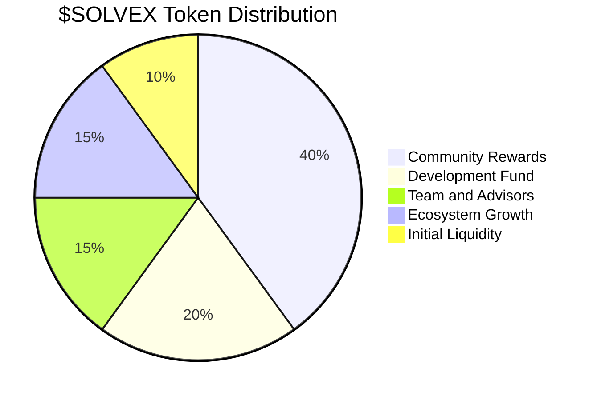

# Tokenomics of $SOLVEX

## Functions of $SOLVEX

The $SOLVEX token serves multiple roles within the ecosystem:

- **Staking:** Users stake $SOLVEX to participate in validations, increasing their voting weight.
- **Rewards:** Validators earn $SOLVEX for accurate validations.
- **Fees:** Proposal submitters pay $SOLVEX fees to cover AI analysis and network costs.
- **Governance:** $SOLVEX holders can propose and vote on protocol upgrades.

## Token Distribution

> **Note:** Specific distribution details are hypothetical, as no official data is provided.

- **Total Supply:** 1,000,000,000 $SOLVEX
- **Allocation:**
  - 40%: Community Rewards (validation and staking incentives)
  - 20%: Development Fund (protocol upgrades, AI enhancements)
  - 15%: Team and Advisors (vested over 3 years)
  - 15%: Ecosystem Growth (partnerships, marketing)
  - 10%: Initial Liquidity (DEX listings)

## Economic Incentives

- **Validators:** Earn $SOLVEX proportional to their RepScore and staked tokens.
- **Submitters:** Pay low fees for high-quality AI and community validation, ensuring cost-effectiveness.
- **Holders:** Benefit from token appreciation as Solvex adoption grows.
