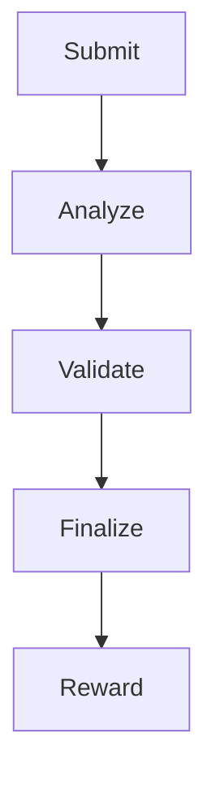

# What is Virtual Proof of Solana (VPoS)?

## Overview

Virtual Proof of Solana (VPoS) is a novel consensus mechanism that enables decentralized validation of proposals without requiring physical staking of SOL tokens or energy-intensive mining. Instead, VPoS relies on a combination of AI-driven analysis, community validation, and a reputation-based system to achieve consensus.

## Why VPoS is Innovative

Compared to traditional PoW and PoS systems, VPoS offers:

- **Energy Efficiency:** Unlike PoW, VPoS does not require computational mining, making it eco-friendly.
- **No Native Staking Requirement:** Unlike PoS, VPoS does not mandate staking SOL, reducing barriers to entry.
- **AI and Community Synergy:** Integrates AI for initial analysis and community validation for final decisions, balancing automation with human judgment.
- **Scalability:** Built on Solana, VPoS supports high transaction throughput, ideal for large-scale governance and validation use cases.

## How VPoS Works

VPoS operates through a five-stage process to validate proposals:

1. **Submit**
   - Description: A user submits a proposal (e.g., a project idea, governance decision, or DeFi audit request) via a Solana wallet.
   - Process:
     - The proposal is submitted as a transaction on the Solana blockchain, including metadata (e.g., description, category, expected outcomes).
     - A small $SOLVEX fee is paid to prevent spam.
   - Output: The proposal is recorded on-chain and queued for analysis.

2. **Analyze**
   - Description: An off-chain AI layer evaluates the proposal for risks, quality, and novelty.
   - Role of AI:
     - Assesses proposal credibility (e.g., feasibility, alignment with ecosystem goals).
     - Flags potential risks (e.g., plagiarism, scams, or technical flaws).
     - Assigns a preliminary score based on predefined criteria.
   - Output: An AI-generated report is published on-chain, accessible to validators.

3. **Validate**
   - Description: Community members review the AI analysis and vote to validate or reject the proposal.
   - Process:
     - Validators with a minimum RepScore (see Reputation System) use their Solana wallets to vote.
     - Votes are weighted by RepScore, ensuring experienced validators have more influence.
     - A threshold of reputation-weighted votes is required for validation (e.g., 60% approval).
   - Community Participation: Any user with a Solana wallet and sufficient RepScore can participate, fostering inclusivity.
   - Output: The proposal is marked as validated or rejected based on community consensus.

4. **Finalize**
   - Description: If validated, the proposal is finalized and recorded as an immutable on-chain record.
   - Process:
     - The proposal’s status is updated on the Solana blockchain.
     - Associated metadata (e.g., validation results, AI report) is stored for transparency.
   - Output: The proposal becomes actionable (e.g., a DAO can implement a governance decision, or a startup can proceed with funding).

5. **Reward**
   - Description: Validators are rewarded based on their participation and accuracy.
   - Process:
     - Validators who voted correctly (aligned with the majority) earn $SOLVEX tokens.
     - Rewards are proportional to RepScore and staked $SOLVEX.
     - Incorrect validators may lose RepScore or face temporary penalties.
   - Output: Tokens and reputation updates are distributed, incentivizing honest participation.
